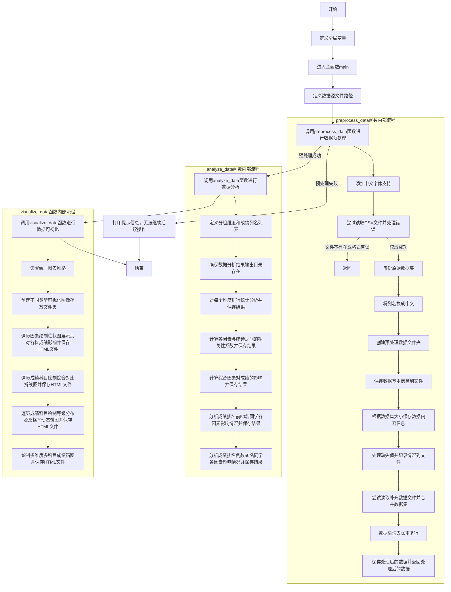

<h1>
代码分析
</h1> 

### 一、代码整体结构与功能概述

这段Python代码主要实现了对学生成绩数据的处理、分析以及可视化展示功能。通过一系列函数操作，从读取原始数据文件开始，经过预处理、多种维度的数据分析，最终以可视化图表（如柱状图、折线图、饼图、箱图等）呈现数据特征，并将相关分析结果保存为文本文件，旨在深入挖掘数据中诸如不同因素对成绩的影响、成绩分布情况等有价值的信息。

### 二、导入的库及作用

1. **`os`库**：用于操作系统层面的文件和目录操作，例如创建文件夹（通过`os.makedirs`
   函数确保相关文件夹存在）以及拼接文件路径（利用`os.path.join`函数组合文件夹路径与文件名等形成完整路径），在整个代码中保障了数据文件、备份文件以及分析结果文件等能正确地保存与读取。
2. **`mpld3`库**：其核心功能是把`matplotlib`绘制的图表转换为`HTML5`
   格式。这样做的好处是使得生成的可视化图表能够方便地以网页形式展示、分享，无需额外依赖专业的绘图软件，增强了可视化结果的传播性和交互性。
3. **`pandas`库**：作为数据处理与分析的强大工具，在代码中承担了诸多关键任务。像使用`read_csv`函数读取`CSV`
   格式的学生成绩数据文件，还用于数据的合并（如尝试读取补充数据文件并与主数据集合并的操作）、处理缺失值（通过各种填充方法对不同列的缺失值进行处理）、分组计算统计指标（依据不同维度对数据分组后计算平均值、标准差等统计量）等一系列操作，为后续的数据分析和可视化奠定了数据基础。
4. **`seaborn`库**：它构建在`matplotlib`之上，提供了更高级、更美观的绘图功能。在代码里通过`sns.set_theme`
   函数统一设置图表的主题风格（包括网格样式、调色板、字体大小等方面），使生成的图表具有一致且美观的视觉效果，同时也方便地绘制出如箱图等复杂的可视化图表，提升了数据可视化的质量和效率。
5. **`matplotlib`库及其子模块`matplotlib.pyplot`**：是Python中基础且常用的绘图库，`matplotlib`
   用于配置一些绘图的全局参数（如设置中文字体显示、负号正常显示等通过`rcParams`进行相关配置），`matplotlib.pyplot`
   则提供了众多创建图表、设置图表各元素（如图表标题通过`plt.title`函数、坐标轴标签分别用`plt.xlabel`和`plt.ylabel`
   函数、图例显示通过`plt.legend`函数等）的方法，是整个可视化部分的核心基础支撑。
6. **`plotly.express`库**
   ：主要用于创建具有动态交互效果的可视化图表，在代码中体现为创建动态的饼图来展示学生成绩等级分布及及格率情况，通过其内部机制基于传入的数据生成可以交互的图表（例如鼠标悬停查看详细数据等），更直观地呈现数据信息，增强用户对数据的探索性。
7. **`scipy.stats`库**：其中的`normaltest`函数用于进行正态性检验，对学生各科成绩数据判断是否符合正态分布，返回的统计量和`p`
   值可以帮助决定后续分析方法的选择以及对数据特征的理解，为更科学合理地进行数据分析提供依据。

### 三、全局变量

定义了三个全局变量：

1. `_src_folder`：代表数据源文件夹的路径，指明了存放原始学生成绩数据文件（如`StudentsPerformance.csv`
   ）所在的文件夹位置，其命名采用下划线开头的方式，遵循一种约定俗成表示私有或内部使用变量的习惯，且通过有意义的英文单词清晰体现其用途。
2. `_dst_folder`：表示备份文件夹的路径，用于存放备份的原始数据集等相关文件，方便在数据处理过程中保留原始数据副本，以备后续查验或者其他需求使用。
3. `_analytical_results_output_folder`
   ：是分析结果输出文件夹的路径，后续经过数据预处理、分析、可视化后的各种结果文件（像统计分析结果文本文件、可视化图表对应的`HTML`
   文件等）都会按照代码逻辑有序地保存在该文件夹及其子文件夹内，便于对所有处理结果进行统一的管理和查看。

这些全局变量通过统一管理文件路径，使得代码在涉及文件读取、保存等操作时更具可维护性。如果需要更改数据源位置或者调整结果输出的文件夹等，只需在全局变量定义处修改对应的值，无需在众多使用路径的代码处逐个修改。

### 四、数据预处理函数`preprocess_data`

1. **函数功能概述**
   ：该函数接收学生成绩数据文件的路径以及输出文件夹路径作为参数，对给定的学生成绩数据文件进行全面的预处理操作，涵盖数据清洗、合并操作，同时备份原始数据集，最后返回经过预处理后的学生成绩数据（以`pandas`
   的`DataFrame`形式），为后续的数据分析和可视化做准备。
2. **关键代码分析**：
    - **设置中文字体支持**：
        - 通过`mpl.rcParams['font.sans-serif'] = ['SimSun']`和`mpl.rcParams['axes.unicode_minus'] = False`
          设置，确保在后续绘制图表时，图表中的中文元素（如标题、坐标轴标签、图例等）能正常显示，且负号也能正确呈现，避免出现乱码或显示异常的问题，增强图表的可读性和准确性。
    - **读取`CSV`文件及错误处理**：
        - 使用`try-except`语句尝试通过`pd.read_csv`函数读取指定路径的`CSV`
          文件。捕获了两种可能出现的错误，若文件不存在会抛出`FileNotFoundError`
          ，此时函数打印提示信息告知用户检查文件路径并返回`None`；若文件格式有误无法正确解析则抛出`pd.errors.ParserError`
          ，同样打印相应提示让用户核对数据格式后返回`None`，这种错误处理机制有效地避免了因文件相关问题导致程序意外崩溃，保障程序的稳定性。
    - **备份原始数据集**：
        - 首先利用`os.path.join`函数将备份文件夹路径（`_dst_folder`）和文件名（`StudentsPerformance_backup.csv`
          ）拼接成完整的备份文件路径（`backup_path`），然后通过`os.makedirs`确保备份文件夹存在（`exist_ok=True`
          表示若文件夹已存在则不会报错），最后使用`data.to_csv`将原始数据保存到备份文件中（设置`index=False`
          表示不保存索引列），实现了原始数据的备份功能，便于后续追溯原始数据情况。
    - **列名中文替换**：
        - 通过定义一个映射字典`column_mapping`，将英文列名（如`gender`、`race/ethnicity`
          等）对应替换为中文列名（如`性别`、`种族/民族`等），再使用`data.rename`
          函数按照字典映射进行列名的重命名操作，这种方式灵活且方便维护，使得后续处理和分析过程中使用中文列名更直观易懂，尤其在涉及数据展示等环节能更好地被理解。
    - **保存数据基本信息及内容信息**：
        - 创建预处理数据文件夹（同样使用`os.makedirs`并设置`exist_ok=True`
          确保文件夹存在），然后根据数据集的大小（通过`data.shape`
          获取行数和列数来判断）决定保存全部数据内容信息（数据集较小时）还是只保存前几行数据内容信息（数据集较大时），将相应信息通过文件写入操作保存到对应的文本文件中（使用`with open`
          语句打开文件并写入内容），方便后续查看数据概况以及了解数据的大致内容结构。
    - **处理缺失值**：
        - 对于成绩相关列（`数学成绩`、`阅读成绩`、`写作成绩`
          ），先记录填补前各列的缺失值数量，然后采用中位数填充的方法（通过`data[col].median()`获取中位数并用`fillna`
          函数填充），再记录填补后缺失值数量，并将处理情况（如填补前后缺失值数量、采用的填补值等信息）添加到`missing_info`
          列表中，最后将整个列表内容写入到`missing_value_info.txt`文件中，清晰记录了缺失值的处理过程和结果。对于`午餐`
          列采用众数填充，`备考课程`列根据`父母教育水平`进行映射填补，根据不同列的数据特点采用了合适的缺失值处理策略，以保证数据的完整性和合理性。
    - **读取补充数据文件并合并数据集**：
        - 通过`os.path.join`
          组合数据源文件夹路径和补充数据文件名形成完整路径，判断该路径对应的文件是否存在，若存在则使用`pd.read_csv`
          读取补充数据，再通过`pd.merge`函数依据`学生编号`列将补充数据与主数据集进行左连接合并，进一步丰富了数据内容，为后续更全面的分析提供更多维度的数据。
    - **数据清洗去除重复行**：
        - 使用`data.drop_duplicates`函数直接去除数据集中的重复行，保证数据的唯一性，避免重复数据对后续分析结果产生干扰，确保分析基于准确有效的数据进行。
    - **保存处理后的数据**：
        - 将经过上述一系列预处理操作后的数据集保存到预处理数据文件夹下指定的文件（`StudentsPerformance_processed.csv`
          ）中，同样设置`index=False`以及合适的编码（`encoding='utf-8-sig'`）来确保数据能正确保存，便于后续函数调用该处理后的数据进行进一步的分析和可视化操作。

### 五、数据分析函数`analyze_data`

1. **函数功能概述**
   ：以经过预处理后的学生成绩数据以及输出文件夹路径作为输入参数，对数据从多个维度展开分析，包括计算不同维度下各科成绩的多种统计指标（平均值、标准差、最值、分位数等）、分析成绩排名前50名和倒数50名同学各因素影响情况、探究各因素与成绩的相关性、构建综合因素指标并分析其对成绩的影响，最后将各个分析结果分别保存到对应的文本文件中，便于查看和进一步研究数据内在的规律和关系。
2. **关键代码分析**：
    - **定义分组维度和成绩列名列表**：
        - 定义`dimensions`列表包含`种族/民族`、`性别`、`父母教育水平`、`午餐`、`备考课程`
          等维度，这些维度将作为后续分组分析的依据，用于观察不同因素对成绩的影响。`score_cols`
          列表包含`数学成绩`、`阅读成绩`、`写作成绩`，明确了要分析的成绩相关列，整体清晰界定了后续分析的范围和对象。
    - **各维度统计分析及结果保存**：
        - 通过循环遍历`dimensions`
          列表中的每个维度，针对每个维度分别计算各科成绩的平均值、标准差、最大值、最小值、25分位数、75分位数等统计指标（使用`groupby`
          函数按照维度分组后，调用相应的统计函数如`mean`、`std`、`max`、`min`、`quantile`等来实现），同时使用`normaltest`
          函数对各科成绩进行正态性检验，判断是否符合正态分布（依据`p`值大小，通常`p`值大于`0.05`
          认为符合正态分布），并将这些结果分别整理成合适的格式后保存到以维度名处理后的对应文件中（对维度名中的特殊字符`/`
          和`\\`进行替换，防止路径错误，然后构建不同统计结果对应的文件路径，通过`with open`
          语句将结果写入文件），这样可以全面且有条理地从各个维度剖析成绩数据的特征和分布情况。
    - **计算各因素与成绩之间的相关性系数**：
        - 从数据中选取`性别`、`父母教育水平`、`午餐`、`备考课程`以及各科成绩列，先使用`drop_duplicates`
          去除重复行（避免重复数据对相关性计算产生偏差），然后通过`corr`
          函数计算这些因素与成绩之间的相关性矩阵，最后将相关性矩阵结果保存到指定的文本文件中，相关性系数能够反映各因素与成绩之间线性关系的强弱程度，有助于了解哪些因素对成绩的影响更为显著。
    - **计算综合因素对成绩的影响**：
        - 通过对`性别`、`父母教育水平`、`午餐`、`备考课程`
          这些因素进行编码（将分类数据转换为数值型代码，如`astype('category').cat.codes`
          操作），并按照一定权重组合成一个综合因素指标（通过乘法和加法运算实现编码值的组合），接着按这个综合因素指标进行分组，计算各科成绩的平均值，最后将综合因素对各科成绩影响的结果保存到文件中，这种方式尝试从综合的角度去探究多个因素共同作用对成绩产生的影响，提供了一种多因素分析的思路和方法。
    - **分析成绩排名前50名和倒数50名同学各因素影响情况**：
        - 分别选取数学成绩最高的50名同学（使用`data.nlargest`函数）和最低的50名同学（使用`data.nsmallest`
          函数）的数据，然后针对这两组数据计算各因素与各科成绩的相关性（同样通过`corr`
          函数），并将相关性结果分别保存到对应的文件中，通过对比成绩排名不同的同学群体中各因素与成绩的相关性情况，能够发现哪些因素在成绩较好和较差的学生群体中影响程度有所差异，进一步挖掘数据中隐藏的规律和关系。

### 六、数据可视化函数`visualize_data`

1. **函数功能概述**
   ：该函数接收经过预处理后的学生成绩数据以及输出文件夹路径作为参数，对学生成绩数据进行多样化的可视化展示，涵盖绘制柱状图展示各因素对各科成绩的影响、绘制折线图对比各因素对各科成绩的影响、生成动态饼图展示成绩等级分布及及格率情况以及绘制多维度多科目成绩箱图，同时将这些可视化图表转换为`HTML`
   文档并保存到指定的输出文件夹下相应的子文件夹中，并且对每种可视化结果能进行简单的分析论述（虽然代码中具体论述部分未详细体现，但提供了这样的功能框架），以直观呈现数据信息和数据间的关系，便于更直观地理解数据特征和规律。
2. **关键代码分析**：
    - **设置图表风格**：
        - 使用`sns.set_theme`函数设置图表的整体风格，指定了如`style="whitegrid"`
          （设置图表的网格样式为白色网格，使图表更清晰美观）、`palette="muted"`
          （选择一种柔和的调色板，让颜色搭配更协调）、`font_scale=1.2`
          （适当放大字体，增强图表文字的可读性）等参数，使得后续生成的所有图表在风格上保持统一且具有较好的视觉效果，提升可视化的专业性和美观度。
    - **创建可视化图像存放文件夹**：
        - 通过循环遍历创建不同类型可视化图像存放的文件夹（柱状图、折线图、饼图、箱图对应的文件夹），使用`os.makedirs`
          并设置`exist_ok=True`确保文件夹存在，将不同类型的可视化图表按照类别进行分类保存，便于管理和查看，使整个可视化结果的文件结构更清晰有条理。
    - **绘制柱状图展示各因素对各科成绩的影响**：
        -
        首先定义各因素维度和成绩科目列名，然后遍历每个因素维度，在每次循环中，针对每个成绩科目列计算该因素下的平均成绩（通过`groupby`
        和`mean`函数实现分组求平均），接着调整柱子的位置（根据循环索引和设定的柱子宽度来计算每个柱子的`x`
        坐标位置），使用`plt.bar`函数绘制柱状图，设置好图表的标题、坐标轴标签、图例等元素（通过相应的`plt`
        模块函数实现），再将图表中的特殊字符进行处理（替换维度名中的非法字符）后，利用`mpld3.fig_to_html`将`matplotlib`
        绘制的图表转换为`HTML`格式并保存到对应的文件路径中，通过柱状图能够直观对比不同因素对各科成绩的平均影响程度，观察各因素的影响力差异。
    - **绘制各因素对各科成绩影响的综合对比折线图**：
        - 遍历每个成绩科目列，针对每个科目在循环中再遍历各因素维度，同样计算每个因素下该科目的平均成绩后，使用`plt.plot`
          函数绘制折线图（设置了标记样式如`marker='o'`
          使数据点更明显），并配置好图表的标题、坐标轴标签、图例等元素，然后将科目名称中的特殊字符处理后转换图表为`HTML`
          格式保存到相应文件中，折线图便于观察各因素对某一科目成绩影响的变化趋势以及不同因素之间的对比情况。
    - **绘制各科成绩等级分布及及格率动态饼图**：
        - 定义了成绩等级标签（如`不及格`、`及格`、`中`、`良`、`优`）和对应的成绩等级区间（通过`bins`
          列表定义），针对每个成绩科目列，使用`pd.cut`
          函数根据区间划分数据计算各等级的分布情况，进而算出及格率，然后利用`plotly.express`的`px.pie`
          函数创建动态饼图（设置了标题、文本显示位置和内容格式等参数），最后将饼图保存为`HTML`
          文件，动态饼图可以直观展示成绩在各个等级的占比情况以及及格率信息，并且用户可以通过交互操作查看更详细的数据，增强了数据展示的灵活性和趣味性。
    - **绘制多维度多科目成绩箱图**：
        - 首先使用`plt.subplots`
          函数创建对应行列数的子图矩阵（根据成绩科目列数和因素维度个数确定行列数），接着通过嵌套循环遍历因素维度和成绩科目列，在每个子图中使用`sns.boxplot`
          函数绘制箱图（传入相应的`x`、`y`、`data`等参数指定箱图的横轴、纵轴数据以及数据源），设置好子图的标题以及`x`
          轴标签旋转角度（增强`x`轴标签的可读性），最后将整个图表转换为`HTML`
          格式保存到指定文件路径中。箱图能够展示出数据的分布情况，包括四分位数范围、异常值等信息，通过多维度多科目的箱图可以直观对比不同因素下各科成绩的分布差异，帮助分析数据的离散程度和整体形态。

### 七、主函数`main`

1. **功能概述**
   ：作为整个程序的入口点，起到统筹协调各个功能函数的作用。在主函数中，先是定义了数据源文件的路径（通过`os.path.join`
   结合`_src_folder`全局变量和具体文件名来确定），然后依次调用`preprocess_data`
   函数进行数据预处理，如果预处理成功（即返回的数据不为`None`），接着调用`analyze_data`函数和`visualize_data`
   函数，分别传入预处理后的数据以及分析结果输出文件夹路径作为参数，按流程驱动整个学生成绩数据的处理、分析与可视化展示流程，若预处理失败则打印相应提示信息告知无法继续后续操作。
2. **关键逻辑体现**
   ：通过对各个函数的有序调用，清晰地展现了整个程序的数据处理流程，使得代码各部分功能模块能够协同工作，实现从原始数据到最终分析结果与可视化展示的完整链路，体现了一种模块化、层次化的程序结构设计思路，方便代码的理解、维护以及功能扩展。

### 八、代码整体优势与可改进点

1. **优势方面**：
    - **功能完整性**：涵盖了从数据预处理、多维度数据分析到多样化可视化展示的完整流程，能够较为全面地挖掘学生成绩数据中的各类信息，满足对数据进行深度探究的需求。
    - **代码结构清晰**
      ：采用函数式编程的思想，将不同功能模块封装在各自独立的函数中（如`preprocess_data`、`analyze_data`、`visualize_data`
      等），各个函数职责明确，通过主函数`main`进行统一调度，方便代码的阅读、理解以及后续的维护和扩展。
    - **数据处理与可视化结合紧密**
      ：在对数据进行了详细的分析之后，及时通过多种合适的可视化图表（柱状图、折线图、饼图、箱图等）将分析结果直观呈现出来，便于直观理解数据间的关系以及分析数据蕴含的规律，增强了数据分析的实用性和可读性。
    - **错误处理机制**：在数据读取等关键环节设置了`try-except`
      语句进行错误处理，对于可能出现的文件不存在、文件格式错误等情况能够及时捕获并给出相应提示信息，避免程序意外崩溃，提高了程序的稳定性和健壮性。
2. **可改进点**：
    - **代码复用性优化**：部分代码逻辑（如文件保存路径的拼接、文件夹创建等操作）在多个函数中都有出现，可以考虑进一步封装成独立的小函数，减少代码重复，提高代码复用性。
    - **参数灵活性提升**
      ：目前一些函数的参数设置相对固定，例如在数据预处理中处理缺失值的方法、数据分析里选取成绩排名前/后固定数量（50名）同学等，可以将这些作为参数传入函数，使得代码能够更灵活地适应不同的数据特点和分析需求。
    - **可视化效果优化**
      ：虽然当前使用了多种图表进行可视化，但对于图表的交互功能、颜色自定义等方面还可以进一步深入挖掘，比如为可视化图表添加更多交互操作（如柱状图点击显示详细数据等），或者根据特定需求自定义更美观、更具辨识度的颜色搭配，提升可视化的质量和用户体验。
    - **代码注释补充**
      ：虽然整体代码逻辑比较清晰，但对于一些复杂的操作（如综合因素指标的构建逻辑、部分统计分析方法的含义等）可以添加更详细的注释，方便其他开发人员更快、更准确地理解代码意图，尤其是对于后续可能的代码维护和功能扩展工作会更有帮助。

### 九、程序执行流程

